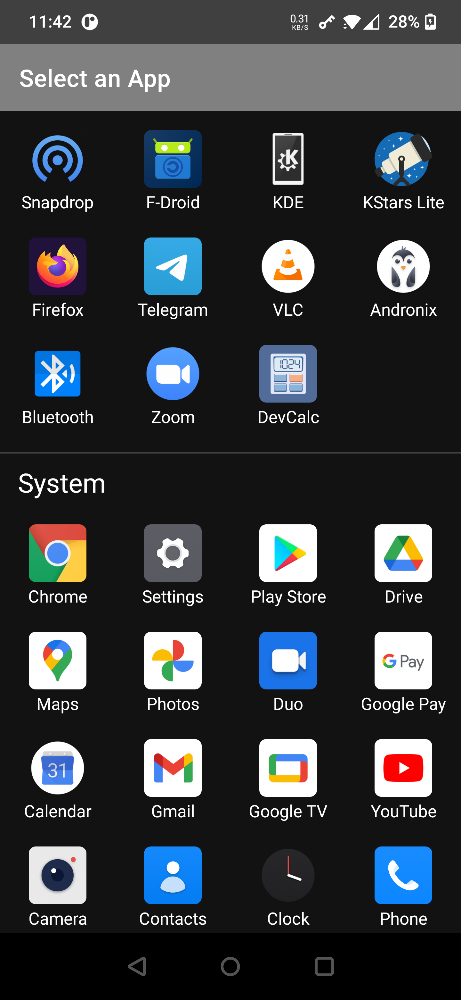
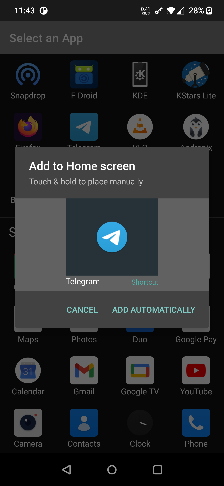
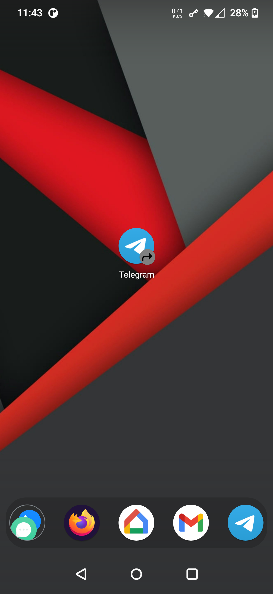

Shortcut Creator
===

App icons are removed from your launcher when an app is uninstalled. This is annoying.

Shortcut Creator lets you replace an app icon with a shortcut. The shortcut isn't removed when the app is uninstalled. The shortcut becomes functional again when the app is re-installed.

Select an app
---

Drag to Launcher
---

Launch like a Normal App
---
